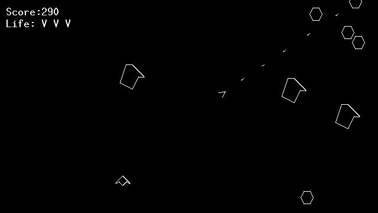

# AsteroidsV32
This is a simple clone of the classic arcade Asteroids for Vircon32. The game uses no texture graphics: it draws everything using only the BIOS.

AsteroidsV32 was made by [glebasos](https://github.com/glebasos) and is offered under the [MIT License](https://mit-license.org/).

Note that there exists a second version of this game, modified so that physics use the virconbox2d library instead. That version can be found among the examples in virconbox2d.
